# AI SAHELI

> High-Level Design (HLD)

**Version:** v1.0 (Draft)  
**Status:** In Progress  
**Repository:** AI-SAHELI  
**Primary Platform:** Android-first, Platform-independent Architecture  
**Related Documents:** Manifesto.md · ROADMAP.md · PRD.md · MVP_SPEC.md

---

## Document Control

| Item | Value |
|------|-------|
| Version | v1.0 |
| Status | Draft |
| Owner | AI SAHELI Project |
| Repository | AI-SAHELI |
| Last Updated | YYYY-MM-DD |
| Next Review | TBD |

---

## Table of Contents

...

# 1. Introduction

## 1.1 Purpose

This High-Level Design (HLD) document defines the complete software architecture of **AI SAHELI – Empowering Every Voice**.

AI SAHELI is a privacy-first, voice-first AI companion platform designed to help people interact naturally with technology while providing accessibility, trusted relationships, safety, and personalised assistance across multiple devices.

The purpose of this document is to translate the product vision and behaviour defined in the Product Requirements Document (PRD) into a scalable, secure, extensible, and production-ready architecture.

Unlike implementation-focused design documents, this HLD describes the complete target architecture of AI SAHELI rather than only the functionality delivered by the initial Interview MVP.

Specifically, this document defines:

* The overall system architecture.
* Major architectural components and their responsibilities.
* Relationships between system components.
* High-level data and control flow.
* Architectural boundaries.
* Security and privacy boundaries.
* Trust and safety architecture.
* AI runtime architecture.
* Platform integration.
* Deployment strategy.
* Scalability strategy.
* The relationship between the complete AI SAHELI platform and the Interview MVP.

The HLD serves as the architectural blueprint for all future implementation work and forms the foundation for the Low-Level Design (LLD), API specifications, Architecture Decision Records (ADRs), testing strategy, and production implementation.

The architecture described in this document is intentionally designed to support long-term evolution while ensuring that the Interview MVP represents the first production-quality slice of the final AI SAHELI platform rather than a standalone prototype.

---

## 1.2 Product Context

AI SAHELI is designed as an **AI Companion**, not simply as a voice assistant or command execution system.

Traditional assistants primarily react to explicit commands by performing isolated tasks. AI SAHELI instead focuses on building an ongoing, trusted, contextual relationship with the user while ensuring that the human always remains in control.

The platform is designed around several core principles established in the frozen product documents:

* AI Companion, not AI Assistant.
* Human Always in Control.
* Privacy by Design.
* Progressive Trust.
* Relationship Before Permission.
* Personal Intelligence, Shared Trust.
* One Companion, Many Devices.
* Learn Through Conversation.
* Just-In-Time Personalisation.
* Trust Through Transparency.

These principles influence every architectural decision described throughout this document.

Although the Interview MVP demonstrates only a subset of capabilities, the target platform is expected to evolve to support:

* Voice-first smartphone interaction.
* Natural conversations.
* Long-term conversational memory.
* Context awareness.
* Situational reasoning.
* Trusted Circle relationships.
* Emergency and safety workflows.
* Personalisation.
* Proactive assistance.
* Accessibility.
* Multi-device experiences.
* Wearables.
* Smart-home integration.
* Healthcare-related assistance.
* Local and cloud AI execution.

Accordingly, the architecture is intentionally designed to accommodate future growth without requiring fundamental redesign.

---

## 1.3 Architecture Scope

This High-Level Design defines the **complete target architecture** for AI SAHELI.

The HLD is **not limited** to the functionality implemented by the Interview MVP.

Instead, it establishes the architectural foundation required to support both current and future product capabilities.

The architecture includes, but is not limited to:

* Companion Runtime
* Conversation Architecture
* Memory Architecture
* Context Architecture
* Situational Reasoning Engine
* Trust Engine
* Safety Engine
* Personalisation Engine
* Proactive Assistance Engine
* Trusted Circle
* Android Platform Integration
* AI Runtime and Model Management
* Security Architecture
* Backend and Cloud Services
* Cross-Device Communication
* Deployment Architecture
* Scalability Strategy

The architecture is designed using the following guiding principles:

### Complete Architecture First

The complete AI SAHELI platform architecture is designed before implementation begins.

### MVP as the First Slice

The Interview MVP is implemented as the first production-quality subset of the complete architecture rather than as an isolated demonstration project.

### Android-First, Platform-Independent

The first implementation targets Android to maximise development efficiency and demonstrate core capabilities.

However, the architecture itself remains platform-independent and is intentionally designed to support future client platforms, including wearables, tablets, web interfaces, smart-home devices, automotive platforms, and other companion-enabled devices.

### Local-First, Cloud-Optional

Essential companion capabilities should operate locally whenever practical.

Core user interaction, accessibility workflows, and safety-critical operations should continue functioning even when network connectivity is unavailable.

Cloud services enhance the platform by enabling capabilities such as synchronisation, remote collaboration, model distribution, analytics, and optional AI inference, but essential companion behaviour must not depend exclusively on cloud availability.

### Evolution Without Redesign

Every architectural component should be capable of evolving independently while maintaining compatibility with the overall platform architecture.

Future product expansion should primarily involve extending existing components rather than replacing or redesigning the architectural foundation established by this HLD.

## 1.4 Interview MVP Scope

The Interview MVP represents the first production-quality implementation milestone of AI SAHELI.

Its objective is to demonstrate the core architectural concepts of the platform while delivering a meaningful end-to-end user experience.

The Interview MVP is intentionally limited in scope and does not attempt to implement every capability described in the complete AI SAHELI product vision.

Instead, it validates the architectural foundation upon which future product releases will be built.

The Interview MVP includes the following core capabilities:

### Voice Interaction

* Local wake-word detection where technically feasible.
* Hindi voice command recognition.
* Voice-driven application control.
* Voice confirmations through Hindi Text-to-Speech (TTS).

### Android Interaction

* Launching supported Android applications.
* Accessibility Service integration.
* Basic navigation actions.
* Scroll operations.
* Device interaction through approved Android APIs.

### Trusted Communication

* Calling a predefined Trusted Contact.
* Basic Trusted Circle support.
* Contact selection defined during onboarding.

### Emergency Assistance

* Emergency keyword detection.
* Safety countdown with user cancellation.
* Audible countdown prompts.
* Automatic escalation when not cancelled.
* SMS and/or phone call to the Trusted Contact.

### Companion Intelligence

The Interview MVP introduces simplified implementations of:

* Companion Runtime.
* Conversation Management.
* Context Management.
* Memory Management.
* Trust Management.
* Safety Management.

These implementations intentionally prioritise architectural correctness over feature completeness.

### Deferred Capabilities

The following capabilities remain outside the Interview MVP scope and will be introduced in future releases:

* Long-term conversational memory.
* Advanced situational reasoning.
* Continuous learning.
* Multi-language conversations.
* Cross-device synchronisation.
* Wearable integration.
* Smart-home integration.
* Healthcare workflows.
* Multi-agent collaboration.
* Federated learning.
* Advanced proactive assistance.
* Cloud memory synchronisation.

Although these capabilities are not implemented initially, the architecture described in this document explicitly accommodates their future introduction.

---

## 1.5 High-Level Design and Low-Level Design Boundary

The High-Level Design (HLD) and Low-Level Design (LLD) serve complementary but distinct purposes.

### High-Level Design

The HLD defines the architectural blueprint of AI SAHELI.

It focuses on:

* Architectural components.
* Component responsibilities.
* System boundaries.
* High-level interfaces.
* Data flow.
* Security boundaries.
* Trust boundaries.
* Safety boundaries.
* Deployment architecture.
* Platform interactions.
* Scalability.
* Architectural constraints.

The HLD explains **what the system is composed of and how the major architectural elements collaborate**.

### Low-Level Design

The LLD translates the approved architecture into an implementable engineering design for the Interview MVP.

It focuses on:

* Module decomposition.
* Package structure.
* Class responsibilities.
* Interface definitions.
* API specifications.
* Database schema.
* State machines.
* Threading model.
* Error handling.
* Configuration.
* Storage implementation.
* Testing strategy.
* Deployment details.

The LLD explains **how the Interview MVP is implemented while remaining consistent with the HLD**.

### Architectural Relationship

The relationship between project documents is illustrated below:

```text
Manifesto
      │
      ▼
ROADMAP
      │
      ▼
PRD
      │
      ▼
MVP_SPEC
      │
      ▼
High-Level Design
      │
      ▼
Low-Level Design
      │
      ▼
Implementation
```

Changes to implementation should normally be reflected in the LLD.

Changes that alter architectural responsibilities or system structure should first be reviewed through the HLD.

Changes affecting product behaviour should originate in the PRD before being reflected in downstream architecture or implementation documents.

This hierarchy ensures clear traceability between product intent, architecture, design, and implementation.

---

## 1.6 Design Objectives

The AI SAHELI architecture is designed to satisfy the following engineering objectives.

### 1. User-Centred

The system should enable intuitive, natural, and accessible interaction for users with varying levels of digital literacy.

### 2. Human Control

Users remain in control of permissions, relationships, memories, safety actions, and information sharing.

The companion should assist, never override, the user's intent except where explicitly authorised by the user during predefined safety workflows.

### 3. Privacy by Design

Privacy is a foundational architectural principle rather than an optional feature.

The system should minimise data collection, process information locally whenever practical, and share personal information only with explicit user consent or previously authorised safety policies.

### 4. Local-First Operation

Essential companion behaviour should continue functioning without dependence on cloud services whenever technically feasible.

Safety-critical workflows must remain resilient during intermittent or complete loss of network connectivity.

### 5. Modular Architecture

Major capabilities—including conversation, memory, context, reasoning, trust, safety, and platform integration—should evolve independently through clearly defined architectural boundaries.

### 6. Extensibility

The architecture should support future expansion without requiring fundamental redesign.

Examples include:

* Additional languages.
* New AI models.
* New Android capabilities.
* Wearables.
* Smart-home devices.
* Healthcare integrations.
* New companion experiences.

### 7. Trustworthiness

Users should understand why AI SAHELI performs significant actions.

Permission handling, emergency workflows, and information sharing should remain transparent, predictable, and auditable.

### 8. Security

Security considerations—including authentication, authorisation, encryption, secure storage, and data isolation—should be incorporated throughout the architecture rather than added after implementation.

### 9. Reliability

Core companion services should remain stable and predictable under normal operating conditions, degraded network connectivity, and unexpected failures.

Safety workflows should favour deterministic behaviour over probabilistic AI decision-making.

### 10. Production Evolution

The Interview MVP should represent the beginning of the production platform.

Engineering decisions should prioritise long-term maintainability, scalability, and architectural consistency over short-term implementation convenience.

Every completed component should remain reusable as AI SAHELI evolves beyond the initial MVP.

## 1.7 Intended Audience

This High-Level Design (HLD) is intended for individuals involved in the design, development, review, deployment, operation, and future evolution of AI SAHELI.

The document provides a common architectural understanding across technical disciplines while maintaining traceability to the frozen product documentation.

The primary audience includes:

### Software Architects

Responsible for defining, reviewing, and evolving the overall AI SAHELI architecture while ensuring long-term scalability, maintainability, and consistency.

### Android Engineers

Responsible for implementing Android platform integration, accessibility services, voice interaction, permissions, device capabilities, and user experience.

### AI and Machine Learning Engineers

Responsible for conversation intelligence, language models, wake-word detection, speech recognition, emotion understanding, reasoning models, and future AI capabilities.

### Backend Engineers

Responsible for cloud services, synchronisation, trusted relationship management, notifications, model distribution, account services, and future platform capabilities.

### Security and Privacy Engineers

Responsible for authentication, authorisation, encryption, secure storage, privacy controls, auditability, and regulatory compliance.

### DevOps and Platform Engineers

Responsible for deployment pipelines, cloud infrastructure, monitoring, observability, scalability, reliability, and operational excellence.

### Quality Assurance Engineers

Responsible for validating functional behaviour, architectural compliance, reliability, accessibility, security, and safety workflows.

### Product Managers

Responsible for ensuring architectural decisions remain aligned with product vision, roadmap, and user requirements.

### Technical Reviewers

Interviewers, open-source contributors, and engineering reviewers seeking to understand the AI SAHELI platform architecture.

Readers are expected to possess a general understanding of modern software engineering principles, distributed systems, mobile application development, and AI-assisted software systems.

---

## 1.8 Document Relationships

AI SAHELI follows a layered engineering documentation model where each document serves a distinct purpose while remaining traceable to upstream decisions.

The document hierarchy is illustrated below.

```text
Manifesto
      │
      ▼
Defines WHY AI SAHELI exists

ROADMAP
      │
      ▼
Defines the long-term product evolution

PRD
      │
      ▼
Defines WHAT AI SAHELI should do

MVP_SPEC
      │
      ▼
Defines WHAT will be implemented first

High-Level Design
      │
      ▼
Defines HOW the complete platform is architected

Low-Level Design
      │
      ▼
Defines HOW the Interview MVP is implemented

Implementation
      │
      ▼
Builds the production-quality MVP

Architecture Decision Records (ADR)
      │
      ▼
Capture WHY significant architectural decisions
were made throughout the project lifecycle.
```

Each document builds upon the preceding documents while maintaining clear separation of responsibilities.

Changes to product behaviour should originate in the PRD before influencing architecture.

Changes to architecture should be reflected in the HLD before implementation changes are introduced in the LLD.

This hierarchy ensures long-term consistency, maintainability, and traceability.

---

## 1.9 Related Documents

The following documents collectively define AI SAHELI.

| Document     | Status      | Purpose                                                    |
| ------------ | ----------- | ---------------------------------------------------------- |
| Manifesto.md | Frozen v1.0 | Defines the mission, philosophy, and purpose of AI SAHELI. |
| ROADMAP.md   | Frozen v1.0 | Defines the long-term evolution of the platform.           |
| PRD.md       | Frozen v1.0 | Defines product behaviour and user experience.             |
| MVP_SPEC.md  | Frozen v1.0 | Defines the Interview MVP implementation scope.            |
| HLD.md       | In Progress | Defines the complete platform architecture.                |
| LLD.md       | Planned     | Defines the detailed implementation of the Interview MVP.  |
| docs/ADR/    | Planned     | Records significant architectural decisions and rationale. |

GitHub remains the Single Source of Truth for all approved project documentation.

---

## 1.10 Glossary

The following terminology is authoritative throughout the AI SAHELI architecture.

### AI Companion

An intelligent system that builds an ongoing, personalised, contextual, and trusted relationship with the user rather than simply executing isolated commands.

---

### Companion Runtime

The central orchestration layer responsible for coordinating conversation, context, memory, reasoning, trust, safety, AI services, and platform integration.

---

### Companion Intelligence

The collection of architectural components responsible for understanding, reasoning, learning, personalisation, trust, and decision-making.

---

### Conversation Manager

The component responsible for managing dialogue state, user interactions, clarification, interruptions, and conversation continuity.

---

### Context

Information describing the user's current situation, environment, device state, conversation state, temporal state, relationship state, and other relevant signals.

---

### Context Engine

The component responsible for collecting, maintaining, updating, and providing contextual information to the rest of the platform.

---

### Memory

Information retained by AI SAHELI to improve continuity, personalisation, trust, and long-term interaction.

---

### Working Memory

Temporary information required while processing the current interaction.

---

### Short-Term Memory

Information retained across recent conversations to preserve continuity.

---

### Long-Term Memory

Persistent information intentionally retained to improve future interactions.

---

### Conversation Memory

Historical conversational information used to maintain dialogue continuity.

---

### Preference Memory

User preferences intentionally retained to personalise future interactions.

---

### Relationship Memory

Information describing trusted relationships between the user and members of the Trusted Circle.

---

### Safety Memory

Information relevant to emergency handling, safety preferences, escalation policies, and previous safety events.

---

### Situational Reasoning

The process of combining conversation, memory, context, trust, safety, and environmental information to determine the most appropriate action.

---

### Trust Engine

The component responsible for consent management, permissions, relationship trust, information sharing, and capability access.

---

### Safety Engine

The component responsible for detecting, evaluating, and responding to situations that may require emergency or safety-related actions.

---

### Trusted Circle

A user-approved group of individuals who may participate in authorised collaboration, assistance, or emergency workflows.

---

### Trusted Contact

A Trusted Circle member assigned a specific operational role, such as receiving emergency notifications.

---

### Personalisation Engine

The component responsible for adapting AI SAHELI to each user's preferences, habits, language, and interaction style.

---

### Proactive Assistance

Helpful actions initiated by AI SAHELI based on context, memory, routines, or predictions rather than waiting for explicit commands.

---

### Android Integration Layer

The architectural layer responsible for interacting with Android platform capabilities including Accessibility Services, Contacts, Phone, SMS, Camera, Notifications, Location, and Permissions.

---

### Edge AI

AI inference executed locally on the user's device or nearby trusted hardware.

---

### Cloud AI

AI inference performed using remote computing infrastructure or external AI services.

---

### Interview MVP

The first production-quality implementation of AI SAHELI demonstrating core architectural concepts while remaining compatible with the complete platform architecture.

---

### Full Platform Architecture

The complete target architecture supporting the long-term AI SAHELI vision beyond the initial Interview MVP.

## 1.11 Assumptions

The AI SAHELI architecture is based on the following assumptions. These assumptions define the expected operating environment and guide architectural decisions throughout this document.

### Product Assumptions

* AI SAHELI is designed as a long-term AI Companion platform rather than a single-purpose mobile application.
* The Interview MVP represents the first production-quality implementation of the complete platform architecture.
* Future releases will progressively introduce additional capabilities without requiring fundamental architectural redesign.

### Platform Assumptions

* Android is the first implementation platform.
* The architecture remains platform-independent and is designed to support future client platforms such as wearables, tablets, web applications, smart-home devices, automotive systems, and other companion-enabled devices.
* Platform-specific functionality should remain isolated behind clearly defined interfaces whenever practical.

### User Assumptions

* Users may have varying levels of technical literacy.
* Accessibility and simplicity are primary design goals.
* Voice interaction is expected to be the primary interaction method for many users.
* Users remain the ultimate authority over permissions, relationships, and information sharing.

### AI Assumptions

* AI models will continue evolving throughout the product lifecycle.
* Different AI capabilities may use different specialised models.
* AI inference may execute locally, remotely, or using a hybrid approach depending on capability, device resources, privacy requirements, and network availability.
* Safety-critical decisions should not rely exclusively on probabilistic AI behaviour.

### Connectivity Assumptions

* Internet connectivity may be unavailable, intermittent, or unreliable.
* Essential companion capabilities should continue functioning whenever technically feasible during network loss.
* Cloud services should enhance the user experience rather than become mandatory for core companion functionality.

### Privacy Assumptions

* Personal information belongs to the user.
* Information sharing requires explicit user consent or previously authorised safety policies.
* Privacy requirements may evolve with future regulatory changes.

### Engineering Assumptions

* The project will evolve as an open-source platform.
* GitHub remains the authoritative repository for source code and engineering documentation.
* Architecture documentation evolves through controlled versioning.
* Significant architectural changes should be accompanied by an Architecture Decision Record (ADR).

---

## 1.12 Constraints

The AI SAHELI architecture must operate within a number of technical, operational, and product constraints.

These constraints influence implementation decisions but should not compromise the long-term architectural vision.

### Technical Constraints

* Android operating-system restrictions.
* Accessibility Service limitations and policies.
* Background execution limits.
* Device hardware diversity.
* CPU, memory, battery, and storage limitations.
* Speech-recognition accuracy under noisy conditions.
* Device-specific manufacturer behaviour.

### Product Constraints

* The Interview MVP intentionally implements only a subset of the complete platform.
* Development effort should prioritise architectural correctness over feature completeness.
* Product complexity should grow incrementally across future releases.

### AI Constraints

* AI models may produce probabilistic or imperfect outputs.
* Large language models may generate inaccurate or incomplete responses.
* AI inference latency may vary depending on execution location.
* Local AI execution may be constrained by device resources.

### Security Constraints

* Sensitive information requires secure storage.
* Permission boundaries must be enforced consistently.
* Safety-related actions should remain auditable.
* Security measures should minimise unnecessary user friction while maintaining appropriate protection.

### Privacy Constraints

* Personal data should be minimised wherever practical.
* Local processing is preferred when it satisfies functional requirements.
* Data sharing must remain transparent and user controlled.

### Operational Constraints

* Network connectivity cannot be assumed.
* External AI providers may become unavailable.
* Third-party APIs may change over time.
* Android platform capabilities may evolve across OS versions.

### Engineering Constraints

* The architecture should remain understandable to future contributors.
* Components should minimise unnecessary coupling.
* Interfaces should remain stable wherever practical.
* Long-term maintainability should be prioritised over short-term implementation convenience.

These constraints should guide engineering decisions throughout implementation while remaining consistent with the product vision and architectural principles defined elsewhere in this document.

---

## 1.13 Document Evolution

The AI SAHELI High-Level Design is intended to evolve in a controlled, versioned, and reviewable manner.

The objective is to maintain architectural stability while allowing the platform to grow over time.

### Review Process

Each HLD section follows the same engineering workflow:

1. Draft
2. Review
3. Approval
4. Freeze

Only approved content is considered part of the official architecture.

### Versioning

Major architectural changes should be introduced through a new HLD version (for example, HLD v1.1).

Minor editorial improvements that do not alter architectural meaning may be incorporated without creating a new architectural version.

### Architecture Decision Records

Significant architectural decisions should be documented using Architecture Decision Records (ADRs).

Each ADR should capture:

* The problem or decision.
* Available alternatives.
* Selected approach.
* Architectural rationale.
* Expected consequences.
* Related HLD sections.

This separation allows the HLD to remain focused on architecture while preserving the reasoning behind important design choices.

### Traceability

Architectural changes should remain traceable throughout the engineering documentation hierarchy.

Changes to product behaviour should originate in the PRD before influencing downstream architecture.

Changes to architecture should be reflected in the HLD before implementation updates are introduced in the LLD.

Implementation should remain consistent with the approved HLD and LLD.

### Open-Source Collaboration

As AI SAHELI evolves, community contributions are encouraged.

Contributors should:

* Respect the frozen architecture.
* Discuss significant architectural changes before implementation.
* Update relevant documentation alongside code changes.
* Maintain consistency with established architectural principles.

### Long-Term Vision

The Interview MVP represents the beginning of the AI SAHELI journey rather than its destination.

Future versions of the architecture are expected to introduce new capabilities while preserving the core architectural principles established in this document.

Backward-compatible architectural evolution should be preferred whenever practical.

This High-Level Design serves as the architectural foundation for the long-term evolution of AI SAHELI.


# 2. Architecture Principles

## 2.1 Purpose

This section defines the architectural principles that govern the design, implementation, and evolution of AI SAHELI.

These principles act as decision-making rules for all major platform components, including:

* Companion Runtime
* Conversation
* Memory
* Context
* Situational Reasoning
* Trust
* Safety
* Personalisation
* Proactive Assistance
* Android Integration
* AI Runtime
* Backend Services
* Security
* Deployment
* Cross-Device Communication

The principles are intended to ensure that architectural decisions remain aligned with the AI SAHELI product philosophy, even as technologies, platforms, AI models, and implementation details evolve.

When multiple technical solutions are possible, the option most consistent with these principles should normally be preferred.

---

## 2.2 Principle Hierarchy

AI SAHELI’s architecture is guided by three connected layers of principles:

1. **Human Principles**
   Protect user control, dignity, privacy, safety, and trust.

2. **Companion Intelligence Principles**
   Govern how AI SAHELI understands, reasons, remembers, assists, and learns.

3. **Engineering Principles**
   Govern how the platform is designed, deployed, secured, and evolved.

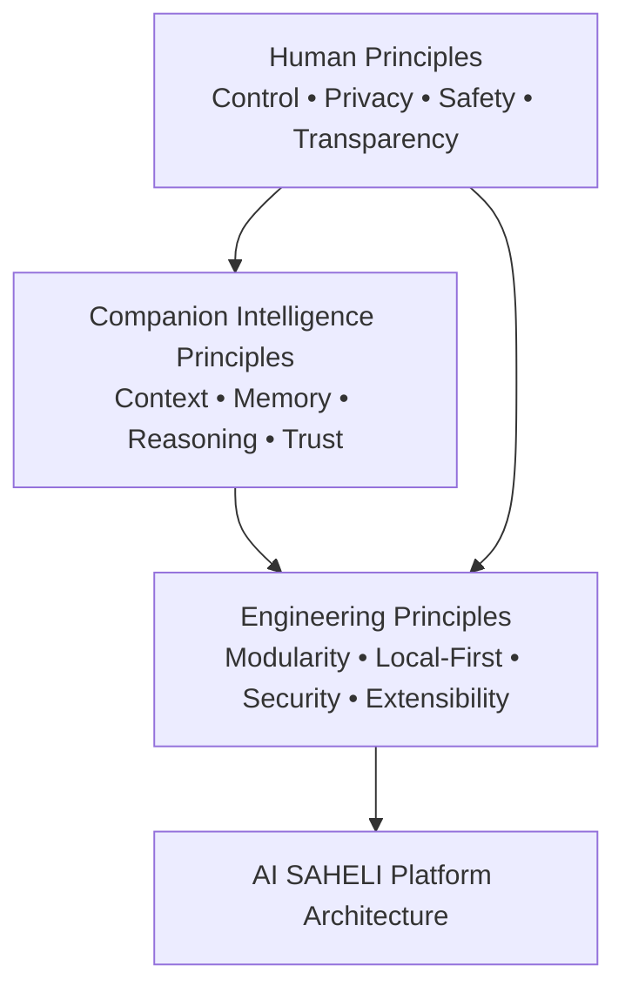

The hierarchy means that engineering convenience must not override human-centred principles.

For example:

* A technically powerful cloud model must not be selected if it creates unacceptable privacy or availability risks.
* A proactive feature must not be implemented if the user cannot understand, control, or disable it.
* An AI-generated decision must not directly trigger a safety-critical action without appropriate deterministic validation.

---

## 2.3 AI Companion First

AI SAHELI must be architected as an **AI Companion Platform**, not as a collection of unrelated assistant features.

A traditional assistant generally follows a command-response pattern:

```text
User Command
     ↓
Intent Detection
     ↓
Action
     ↓
Response
```

AI SAHELI follows a broader companion model:

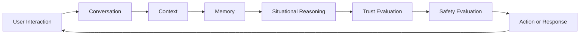

The companion model considers more than the current command.

It may consider:

* Current conversation state
* User preferences
* Recent interactions
* Relationship permissions
* Device state
* Time and location
* Safety context
* Confidence and uncertainty
* Available local and cloud capabilities

### Architectural Implications

* Companion intelligence must be separated from platform-specific integration.
* Conversation, memory, context, trust, and safety must be explicit architectural components.
* User actions should not be treated as isolated events when relevant context exists.
* The architecture must support continuity across interactions and, in future, across devices.

---

## 2.4 Human Always in Control

AI SAHELI must support and strengthen human decision-making rather than silently replacing it.

The user remains the primary authority over:

* Permissions
* Personal data
* Memory
* Trusted relationships
* Information sharing
* Proactive assistance
* Safety preferences
* Emergency cancellation
* Device actions

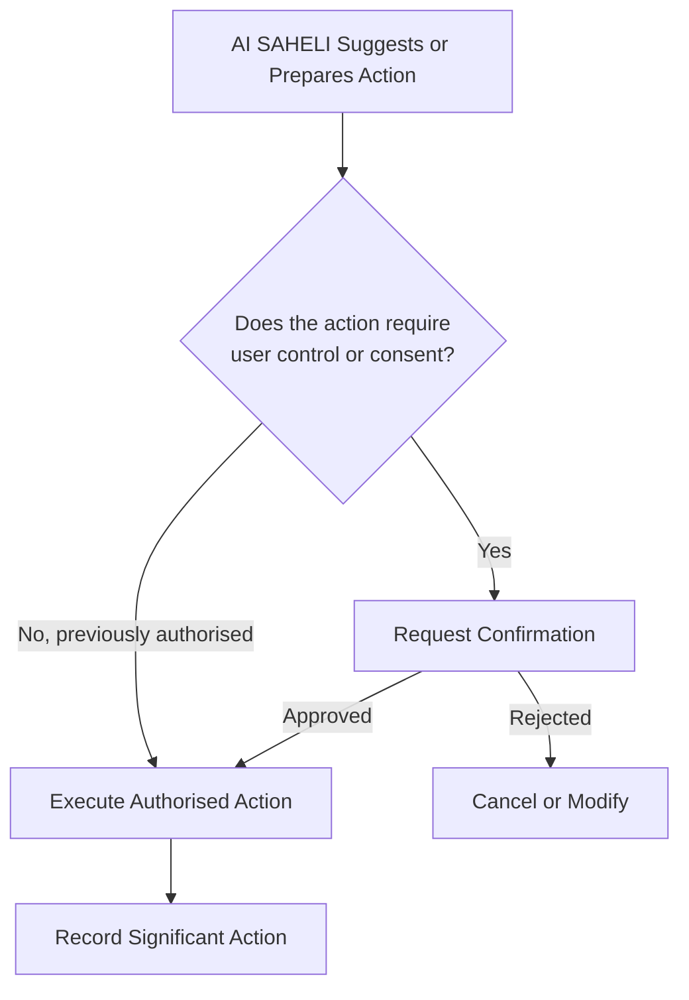

### Architectural Implications

* Significant actions must pass through a policy, consent, or confirmation layer.
* Permissions must be explicit, reviewable, and revocable.
* Emergency escalation must provide cancellation where feasible.
* Proactive assistance must be dismissible and configurable.
* The system must distinguish between suggestion, preparation, and execution.
* Previously authorised safety policies must be represented explicitly rather than inferred informally.

---

## 2.5 Privacy by Design

Privacy must be embedded into every architectural layer.

AI SAHELI should collect, process, retain, and share only the information necessary to deliver an authorised capability.

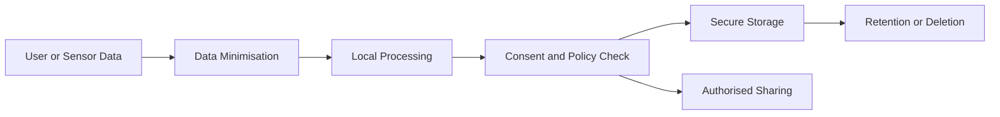

### Privacy Rules

* Prefer local processing when it satisfies the functional requirement.
* Do not store information solely because it may become useful later.
* Separate temporary context from persistent memory.
* Require clear authorisation before sharing personal information.
* Apply purpose limitation to collected data.
* Allow users to inspect, correct, or remove retained information where appropriate.
* Protect sensitive data both at rest and in transit.
* Avoid unnecessary dependency on third-party AI providers.

### Architectural Implications

* Memory must support retention policies and deletion.
* Context must not automatically become permanent memory.
* Trust and consent checks must precede information sharing.
* Cloud-bound data must be minimised and classified.
* Sensitive processing boundaries must be visible in architecture diagrams.
* Privacy controls must apply consistently across Android, backend, AI, and future devices.

---

## 2.6 Local-First and Cloud-Optional

Essential AI SAHELI capabilities should operate locally whenever technically feasible.

The cloud may enhance intelligence, synchronisation, scalability, and collaboration, but core companion and safety behaviour must not depend exclusively on cloud availability.

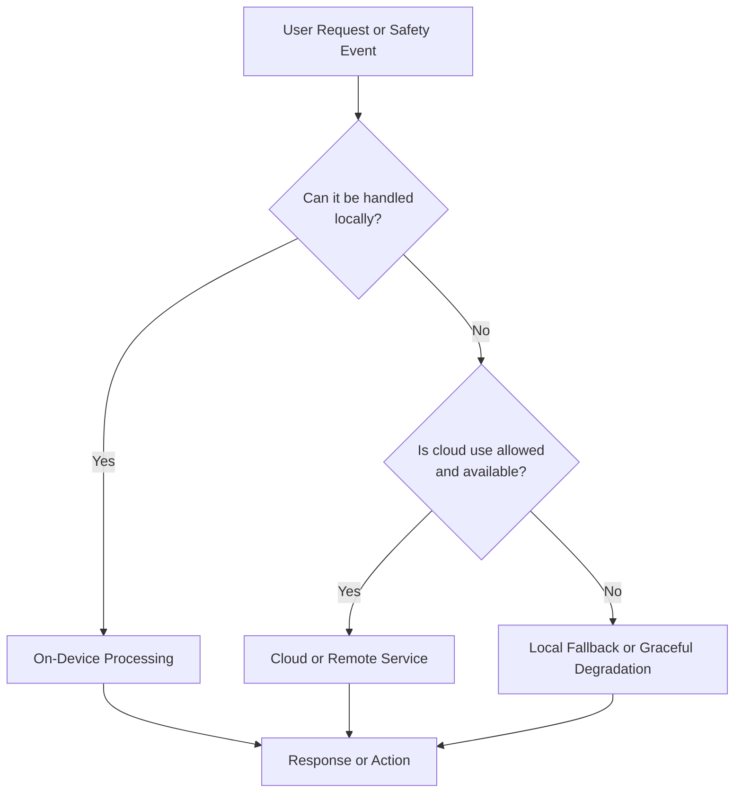

### Local-Mandatory Capabilities

Where feasible, the following should remain locally available:

* Emergency keyword handling
* Emergency countdown
* Cancellation
* Basic Android navigation
* Preset contact access
* Call initiation
* SMS initiation
* Core safety state
* Basic trust configuration
* Basic command handling
* Local text-to-speech
* Essential audit records

### Cloud-Optional Capabilities

Cloud services may enhance:

* Advanced language understanding
* Large language model inference
* Model updates
* Memory synchronisation
* Cross-device continuity
* Remote notifications
* Analytics and operational monitoring
* Trusted Circle collaboration

### Cloud-Required Capabilities

Some capabilities inherently require remote coordination, including:

* Multi-user invitation delivery
* Cross-device synchronisation
* Remote Trusted Circle interaction
* Account recovery
* Shared cloud services
* Remote configuration management

### Architectural Implications

* Components must expose local and remote execution strategies behind stable interfaces.
* Cloud failure must not cause uncontrolled system behaviour.
* Safety flows must define offline and degraded modes.
* Network availability must be treated as context, not as an assumption.
* Remote processing must be governed by privacy, consent, latency, cost, and reliability policies.

---

## 2.7 Safety by Design

Safety is a system-wide architectural responsibility.

It must not be implemented as a single emergency feature or isolated module.

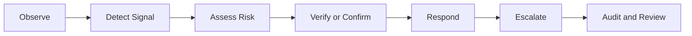

### Safety Principles

* Safety-critical actions should be deterministic wherever practical.
* Generative AI must not be the sole authority for emergency escalation.
* False positives and false negatives must both be considered.
* Users should be able to cancel or correct an action when time and circumstances permit.
* Safety workflows must define timeout, retry, failure, and fallback behaviour.
* Significant safety actions must be auditable.
* Failure of one non-essential component should not disable the complete safety workflow.

### Architectural Implications

* Safety logic must be isolated from conversational creativity.
* Emergency states must be represented using explicit state machines.
* Safety workflows must have clear escalation policies.
* Local safety handling must remain available during network loss.
* Trust and consent rules must be integrated into escalation.
* Safety events must receive higher processing priority than routine companion interactions.

---

## 2.8 Progressive Trust

Trust must be established incrementally through explicit relationships, consent, and observed user-approved interactions.

Being part of a Trusted Circle must not automatically provide unrestricted access to personal data or companion capabilities.

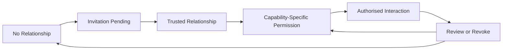

### Architectural Implications

* Relationship state and permission state must be separate.
* Permissions should be capability-specific.
* Trust must be revocable.
* Shared information must be limited by purpose and scope.
* Emergency roles must be explicitly assigned.
* Trust changes must be auditable.
* The platform must support different trust levels for different users and use cases.

---

## 2.9 Relationship Before Permission

Permissions involving another person should be granted within the context of a recognised relationship.

For example, adding someone to the Trusted Circle establishes a relationship but does not automatically grant:

* Location access
* Memory access
* Conversation access
* Health-related information
* Emergency authority
* Device control

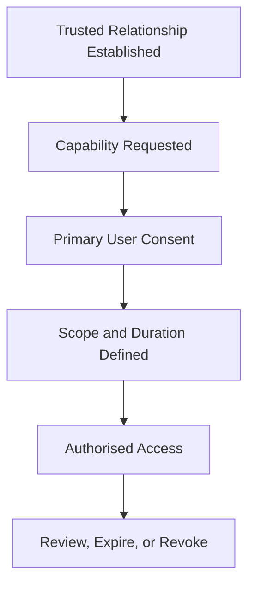

### Architectural Implications

* Identity, relationship, permission, and capability must be separate domain concepts.
* Permission checks must include relationship state.
* Access policies must support purpose, duration, and scope.
* Emergency access must be distinguishable from routine access.
* Shared data must not exceed the permission granted.

---

## 2.10 Modular Companion Intelligence

Companion intelligence must be decomposed into specialised, independently evolvable components.

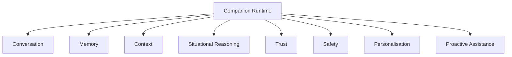

### Architectural Implications

* Each intelligence capability must have a clear responsibility.
* Components must communicate through defined contracts.
* No single component should become an uncontrolled “AI brain.”
* AI models must be replaceable without redesigning the complete platform.
* Safety and trust must remain independently enforceable.
* Context and memory must remain separate concepts.
* Platform-specific code must not be embedded directly into reasoning logic.

---

## 2.11 Platform Independence

AI SAHELI is Android-first but platform-independent.

Android is the initial implementation platform, but companion intelligence must not become inseparable from Android-specific APIs.

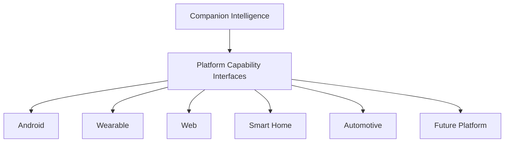

### Architectural Implications

* Platform capabilities must be exposed through abstractions.
* Android-specific implementations must remain inside the Android Integration Layer.
* Companion logic should depend on capabilities rather than concrete Android classes.
* Device capabilities should be discoverable through a capability registry.
* Platform differences should be handled through adapters.
* Future devices should be able to participate without replacing the companion intelligence architecture.

---

## 2.12 Event-Driven Coordination

AI SAHELI must support event-driven coordination between platform services and companion intelligence.

Relevant events may include:

* User speech detected
* Wake word detected
* Intent recognised
* Application launched
* Context changed
* Permission changed
* Emergency keyword detected
* Countdown started
* Countdown cancelled
* Escalation initiated
* Network status changed
* Trusted Circle relationship updated
* Memory updated

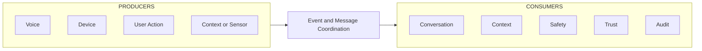

### Architectural Implications

* Components should not require direct knowledge of every other component.
* Events must use stable, versionable contracts.
* Safety-critical events may require priority handling.
* Event delivery guarantees must match the importance of the event.
* Audit events must be distinguishable from operational events.
* Event loops and duplicate processing must be prevented.

Event-driven design does not imply that every interaction must be asynchronous. Direct synchronous calls remain appropriate when an immediate response or transaction boundary is required.

---

## 2.13 Explainable and Transparent Behaviour

Users should be able to understand significant AI SAHELI actions.

The platform should provide clear explanations for:

* Why a permission is requested
* Why information is being shared
* Why a safety workflow was triggered
* Why a Trusted Contact was notified
* Why a proactive suggestion was offered
* What information influenced a response
* Whether an action was local or cloud-assisted

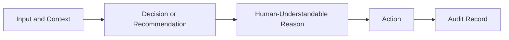

### Architectural Implications

* Significant actions should include reason metadata.
* Trust, safety, and permission decisions must be inspectable.
* The system should distinguish facts, assumptions, predictions, and uncertainty.
* Audit records should support later review.
* Explanations should be appropriate to the user’s language and digital literacy.
* Technical transparency must not expose sensitive internal security information.

---

## 2.14 Graceful Degradation

AI SAHELI should preserve the most important available functionality when a component, model, service, permission, device, or network connection is unavailable.

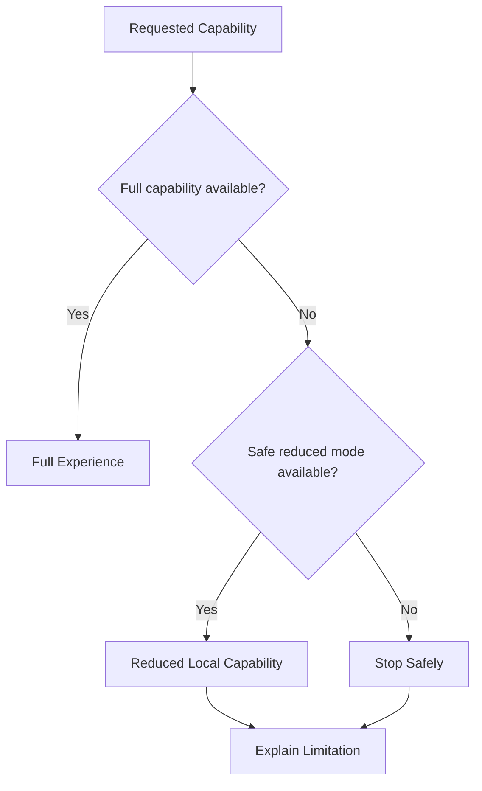

### Examples

* If cloud AI is unavailable, use local intent handling where possible.
* If speech recognition fails, request repetition or provide a simpler interaction path.
* If location permission is unavailable, continue emergency escalation without location rather than abandoning the workflow.
* If SMS fails, attempt an authorised phone call.
* If a non-essential personalisation component fails, preserve the core conversation.
* If an unsafe action cannot be validated, stop safely and inform the user.

### Architectural Implications

* Components must define fallback behaviour.
* Failure boundaries must be explicit.
* User-facing limitations must be communicated clearly.
* Reduced functionality must never create unsafe assumptions.
* Safety fallbacks must be tested independently.

---

## 2.15 Security by Design

Security must be integrated into architecture, implementation, deployment, and operations.

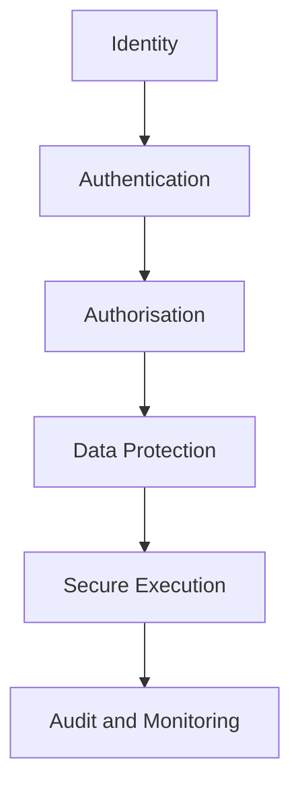

### Architectural Implications

* Apply least privilege.
* Separate authentication from authorisation.
* Encrypt sensitive data at rest and in transit.
* Protect local secrets using platform-secure storage.
* Validate data crossing trust boundaries.
* Restrict external AI and backend access.
* Maintain auditable security-sensitive actions.
* Avoid embedding credentials or secrets in client applications.
* Define threat models for safety, trust, memory, and cross-device capabilities.

---

## 2.16 Replaceable AI Models

AI models and AI providers must be treated as replaceable implementation components rather than permanent architectural dependencies.

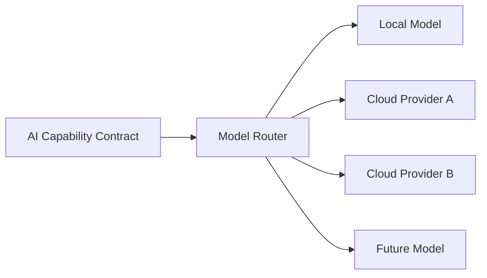

### Architectural Implications

* Components should request capabilities rather than specific model names.
* Model routing should consider privacy, latency, availability, accuracy, and cost.
* Model input and output contracts should be normalised.
* AI-provider-specific logic should remain inside adapters.
* Safety checks must remain independent of the selected generative model.
* Model upgrades should not require redesigning conversation or companion orchestration.

---

## 2.17 Observable and Auditable

The platform must provide sufficient visibility to understand system behaviour, diagnose failures, review safety events, and improve reliability.

Observability must be implemented without violating privacy principles.

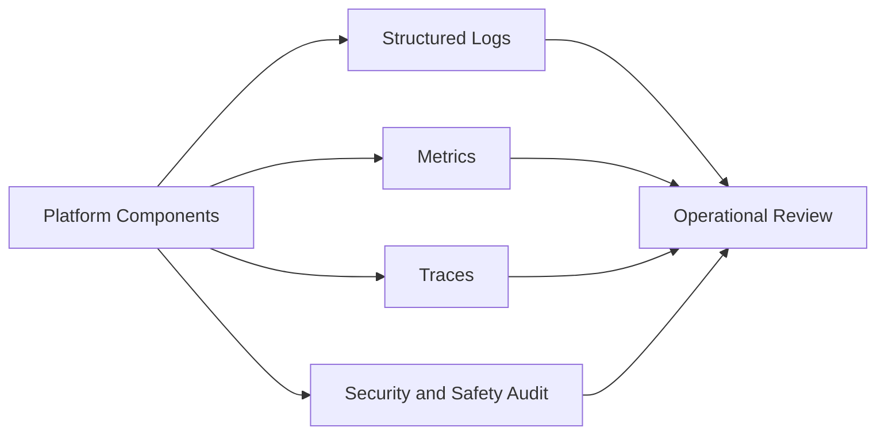

### Architectural Implications

* Operational logs and user audit history must be treated differently.
* Sensitive user content should not be logged unnecessarily.
* Safety and trust actions require durable audit records.
* Component health and failure states should be measurable.
* Distributed interactions should support correlation identifiers.
* Logs must support retention and deletion policies.

---

## 2.18 Extensible Through Stable Contracts

The architecture must support new devices, models, workflows, languages, and companion capabilities through stable contracts.

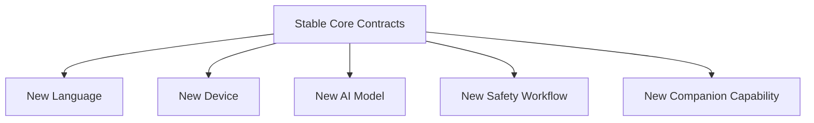

### Architectural Implications

* Interfaces must be capability-oriented.
* Contracts should be versionable.
* Extensions must not bypass trust, safety, or privacy controls.
* Plugin and adapter mechanisms should be used where appropriate.
* Core domain concepts must remain stable.
* Backward compatibility should be preferred where practical.

---

## 2.19 Simple First, Evolvable Always

The complete architecture should be designed for long-term evolution, but the initial implementation must avoid unnecessary complexity.

The principle is:

> Design for the future without implementing the future prematurely.

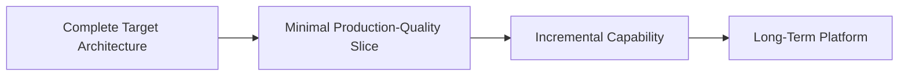

### Architectural Implications

* The MVP should implement stable interfaces even when only one implementation exists.
* Future capabilities may be represented as extension points rather than complete services.
* Infrastructure should not be introduced without a current or clearly anticipated requirement.
* Architectural compatibility is required; speculative implementation is not.
* The platform should prefer simple, testable designs over premature distribution or abstraction.

---

## 2.20 Principle Interaction

Architecture principles must not be applied independently.

For example:

* Local-first must be balanced with device limitations.
* Explainability must be balanced with security.
* Proactive assistance must be balanced with human control.
* Memory must be balanced with privacy.
* Event-driven design must be balanced with simplicity.
* Extensibility must be balanced with maintainability.
* Advanced AI capability must be balanced with safety and determinism.

The following diagram summarises the principle interaction.

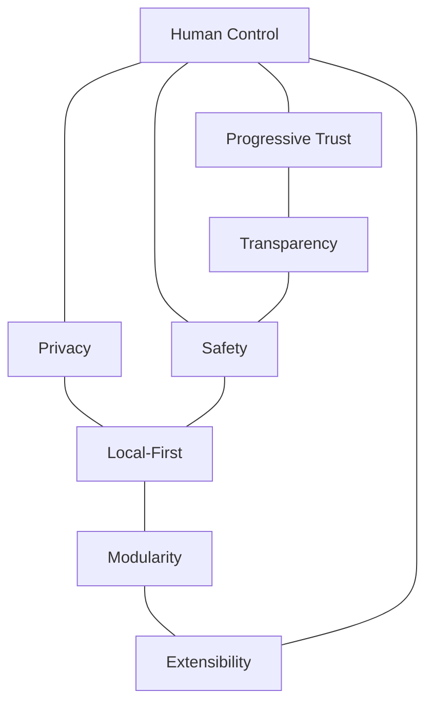

When principles conflict, the following order should generally guide resolution:

1. User safety
2. Human control and consent
3. Privacy and security
4. Reliability
5. Product behaviour
6. Maintainability
7. Performance and cost
8. Implementation convenience

This order is guidance rather than an automatic rule. Significant trade-offs should be documented through an Architecture Decision Record.

---

## 2.21 Interview MVP Application

The Interview MVP applies these principles in a focused form.

| Principle             | Interview MVP Application                                                     |
| --------------------- | ----------------------------------------------------------------------------- |
| AI Companion First    | Uses a basic Companion Runtime rather than independent command handlers.      |
| Human in Control      | Emergency countdown is cancellable.                                           |
| Privacy by Design     | Essential processing and configuration remain local.                          |
| Local-First           | Voice commands, navigation, and safety flow operate on-device where feasible. |
| Safety by Design      | Emergency flow uses explicit state and deterministic escalation.              |
| Progressive Trust     | Uses a predefined Trusted Contact with limited scope.                         |
| Modular Intelligence  | Conversation, context, trust, and safety have separate responsibilities.      |
| Platform Independence | Android capabilities are isolated behind integration interfaces.              |
| Graceful Degradation  | Core device functions continue without backend dependency.                    |
| Replaceable AI        | Speech and intent components are accessed through capability interfaces.      |
| Observability         | Significant safety transitions and failures are recorded.                     |
| Simple but Evolvable  | Only the first production-quality architectural slice is implemented.         |

---

## 2.22 Summary

The architecture principles defined in this section establish the decision framework for the complete AI SAHELI platform.

The most important principles are:

* AI Companion First
* Human Always in Control
* Privacy by Design
* Local-First and Cloud-Optional
* Safety by Design
* Progressive Trust
* Relationship Before Permission
* Modular Companion Intelligence
* Android-First but Platform-Independent
* Event-Driven Coordination
* Explainable Behaviour
* Graceful Degradation
* Security by Design
* Replaceable AI Models
* Observable and Auditable
* Extensible Through Stable Contracts
* Simple First, Evolvable Always

All subsequent HLD sections must remain consistent with these principles.

Where a significant architectural choice requires a trade-off between principles, the decision and rationale should be recorded through an Architecture Decision Record.
